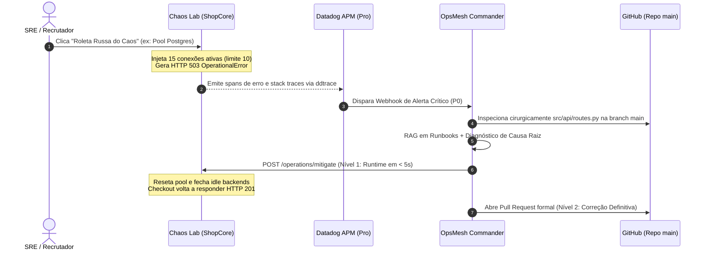

# 🧪 Chaos Lab — ShopCore API Simulator

> **Microsserviço de E-Commerce com Injeção de Falhas para o OpsMesh**  
> **Status:** Produção & Simulação Ativa  
> **Instrumentação:** Datadog Pro APM (`ddtrace`) + Tracing Distribuído  
> **Documentação de API:** [Scalar Interativo](/docs)  
> **OpsMesh Console:** [https://opsmesh-197215016090.us-central1.run.app](https://opsmesh-197215016090.us-central1.run.app)  

---

## 📌 1. Visão Geral

O **Chaos Lab** é um microsserviço de e-commerce (`shopcore-api`) desenvolvido em **FastAPI + Python 3.12** criado especificamente para servir como o ecossistema de testes de resiliência e validação do **[OpsMesh](https://github.com/henriquebotelhogomes/OpsMesh)**.

Ele possui endpoints de negócio reais (catálogo, estoque, checkout, pedidos) e uma camada cirúrgica de **Chaos Engineering**, permitindo acionar manualmente ou via roleta aleatória falhas reais de produção que são capturadas pelo **Datadog APM** e investigadas autonomamente pelo **OpsMesh**.



---

## 💥 2. Catálogo de Falhas Injetáveis

| Cenário de Falha | Endpoint de Injeção | Efeito no Checkout | Stack Trace / Erro Gerado |
| :--- | :--- | :--- | :--- |
| **Esgotamento de Pool Postgres** | `POST /chaos/inject/postgres-pool` | **HTTP 503** | `psycopg2.OperationalError: remaining connection slots are reserved` |
| **Cascade Timeout de Inventário** | `POST /chaos/inject/timeout` | **HTTP 504** | `504 Gateway Timeout: Downstream inventory microservice (15s latency)` |
| **Vazamento de Memória (OOM)** | `POST /chaos/inject/memory-leak` | **Degradação** | Aloca buffers de 25MB a cada compra sem liberação no GC |
| **Oscilação no Gateway de Cartão** | `POST /chaos/inject/payment-flap` | **HTTP 502** | `ExternalGatewayError: Stripe API returned HTTP 502 Bad Gateway` |
| **Schema Mismatch (Bad Migration)**| `POST /chaos/inject/schema-mismatch`| **HTTP 500** | `psycopg2.errors.UndefinedColumn: column orders.tax_rate does not exist` |
| **🎲 Roleta Russa do Caos** | `POST /chaos/roulette` | **Aleatório** | Sorteia aleatoriamente um dos cenários acima |

---

## 🛡️ 3. Remediação em Runtime (Tier 1 do OpsMesh)

O Chaos Lab implementa o endpoint padronizado `POST /operations/mitigate` consumido pelo OpsMesh:

```bash
curl -X POST "http://localhost:8080/operations/mitigate" \
     -H "Content-Type: application/json" \
     -d '{
       "action_type": "DATABASE_CONNECTION_SCALE",
       "requester": "OpsMesh-IncidentSupervisorAgent",
       "details": "Pool scaled up, idle backends terminated."
     }'
```

**Tipos de Ação Suportados:**
* `DATABASE_CONNECTION_SCALE` / `DATABASE_TERMINATE_BACKENDS`: Reseta pool e normaliza conexões.
* `CIRCUIT_BREAKER_ACTIVATE`: Ativa circuit breaker para downstreams lentos.
* `POD_ROLLOUT_RESTART` / `MEMORY_GC_FLUSH`: Libera buffers vazados de memória.
* `SCHEMA_HOTFIX`: Aplica hotfix temporário para compatibilidade de schema.
* `ALL`: Reset emergencial completo de todas as falhas ativas.

---

## 🚀 4. Como Executar Localmente

### Pré-requisitos
* Python 3.12+
* Gerenciador `uv` instalado (`pip install uv` ou `curl -LsSf https://astral.sh/uv/install.sh | sh`)

```bash
# 1. Clonar repositório
cd d:\ChaosLab

# 2. Criar ambiente virtual e instalar dependências
uv venv
.\.venv\Scripts\activate  # Windows
uv pip install -e ".[dev]"

# 3. Executar testes automatizados
pytest -v

# 4. Executar linter
ruff check .

# 5. Iniciar servidor local
uvicorn src.main:app --reload --port 8080
```

Abra no navegador:
* **Dashboard Interativo:** `http://localhost:8080/`
* **Scalar API Reference:** `http://localhost:8080/docs`
* **Health & Telemetria:** `http://localhost:8080/health`

---

## 🐳 5. Execução com Docker & Cloud Run ($0/mês)

```bash
# Build da imagem local
docker build -t chaos-lab:latest .

# Execução
docker run -p 8080:8080 -e APP_ENV=production chaos-lab:latest
```

---

## 📊 6. Integração com Datadog APM

Para habilitar a instrumentação automática do Datadog:
```bash
export DD_TRACE_ENABLED=true
export DD_SERVICE="chaos-lab"
export DD_ENV="production"
export DD_AGENT_HOST="localhost"

ddtrace-run uvicorn src.main:app --host 0.0.0.0 --port 8080
```
